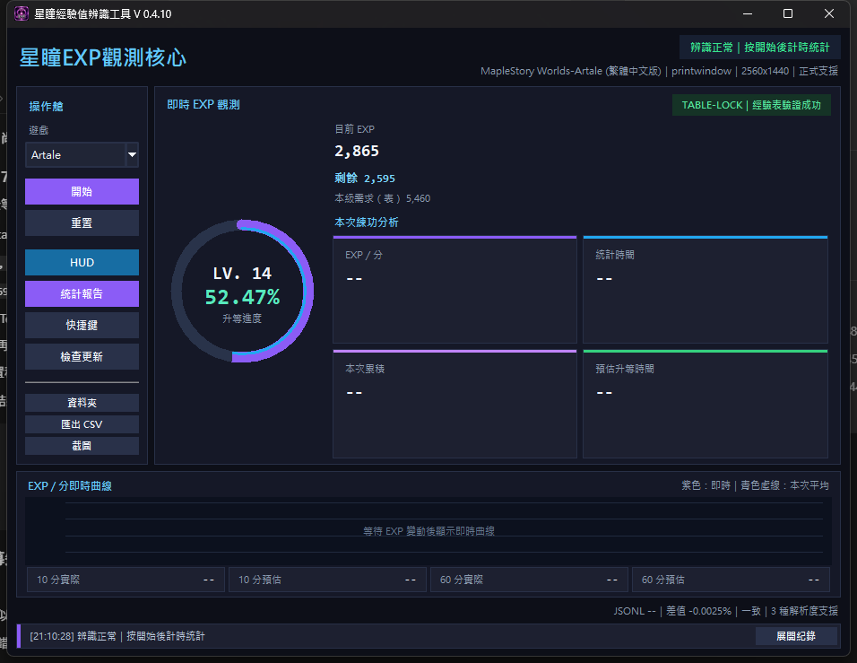
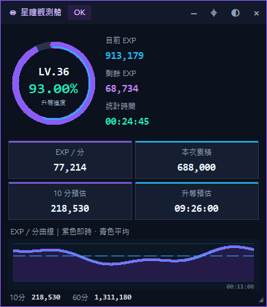
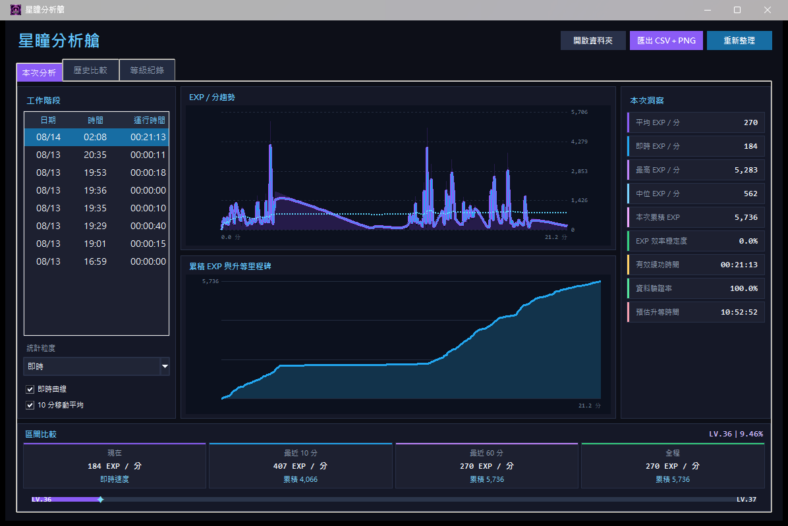

# 星瞳經驗辨識工具

### XingTong EXP

支援 **楓星、Artale、新楓之谷：經典版**。即時辨識遊戲 EXP，將每一次練功轉換成直觀的進度、速度、曲線與統計報告。

[查看最新版本與更新](https://github.com/ayzn0524/MStarBotEXP/releases/latest) · [查看所有版本](https://github.com/ayzn0524/MStarBotEXP/releases)

## 介面預覽

### 即時 EXP 觀測

綁定遊戲視窗後立即預覽目前等級、EXP、升等進度及正式支援狀態；按下「開始」後才建立本次統計基準。

### 懸浮 HUD

可在遊戲旁持續查看目前 EXP、EXP／分、本次累積、10 分鐘預估、升等預估及即時曲線。

  

### 星瞳分析艙

停止工作階段後可查看 EXP／分趨勢、累積 EXP、等級里程碑、本次洞察與區間比較，並輸出 CSV 與 PNG 完整報告。

## 核心功能

- 遊戲視窗自動綁定與即時 EXP OCR
- 綁定後預覽辨識結果，按下「開始」才建立統計基準
- 懸浮 HUD、升等進度與即時 EXP／分曲線
- 本次累積 EXP、有效練功時間及預估升等時間
- 平均、即時、最高及中位 EXP／分
- EXP 效率穩定度與資料驗證率
- 統計分析艙、CSV 匯出及 PNG 圖表完整報告
- GitHub Release 自動更新與更新失敗還原

## 正式支援

| 遊戲 | 正式支援解析度 |
|---|---|
| 經典服 Classic | 1366×768、1920×1080、2560×1440 |
| Artale | 1280×720、全螢幕 |
| 楓星 | 1280×720、全螢幕 |

程式右上角會依目前遊戲與解析度顯示正式支援狀態；未列入的組合會標示為不支援。

## 安裝與更新

### 首次安裝

首次安裝需要標示為「完整主程式」的 PyInstaller onedir 壓縮檔。完整解壓縮到獨立資料夾後，執行 `星瞳經驗辨識工具.exe`；不要只複製 EXE。

### 既有版本更新

1. 優先使用程式內建「檢查更新」。
2. 手動更新時先關閉程式，再依 Release 說明套用更新包。

## 文件與問題回報

- [常見問題](docs/FAQ.md)
- [版本與更新](https://github.com/ayzn0524/MStarBotEXP/releases)
- [提出問題](https://github.com/XingTongTools/XingTong-EXP/issues)

## 公開範圍

此 Repository 用於產品介紹、文件與正式下載導向，不包含核心 Python 原始碼。
